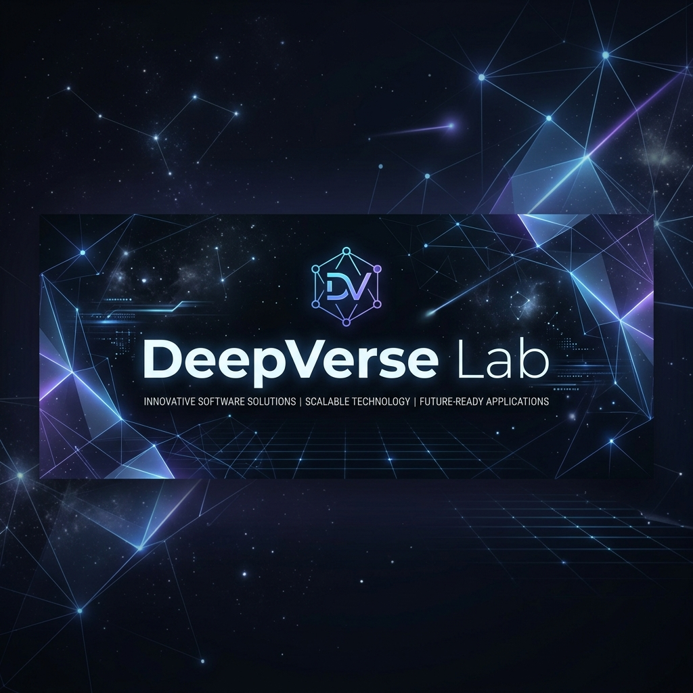

<div align="center">
  

  # 🌌 DeepVerse Lab
  **Innovating Beyond Dimensions**
  
  *Clean code • Scalable systems • Modern engineering*

  <br />

  
  
  
</div>

---

## 👋 Welcome

**DeepVerse Lab** is a technology-driven organization where ideas turn into reliable, production-ready software. We build with care, structure, and long-term vision.

> [!TIP]
> We believe good software should be **beautiful to look at**, **easy to maintain**, and **powerful under the hood**.

---

## 🏛 Core Pillars

<table align="center" style="border: none;">
  <tr>
    <td align="center" width="30%">
      <br />
      
      <br />
      <strong>Research</strong>
      <p>Pushing the boundaries of tech through experimentation.</p>
    </td>
    <td align="center" width="30%">
      <br />
      
      <br />
      <strong>Scalability</strong>
      <p>Robust backend systems built for massive growth.</p>
    </td>
    <td align="center" width="30%">
      <br />
      
      <br />
      <strong>Architecture</strong>
      <p>Clean, modular, and maintainable project structures.</p>
    </td>
  </tr>
</table>

---

## 🛠 Technology Stack

We leverage a modern ecosystem to deliver high-performance solutions:

- **Backend**: `Laravel` • `Flask` • `FastAPI`
- **Mobile**: `Flutter` • `React Native`
- **Frontend**: `React.js` • `TypeScript` • `Next.js`
- **Database**: `MySQL` • `PostgreSQL` • `SQLite`
- **DevOps**: `Docker` • `CI/CD` • `Git`

---

## 🗂 Project Standards

Every project at **DeepVerse Lab** follows a predefined structure for consistency:

```text
project-name/
├── docs/        # Documentation & specs
├── src/         # Application source code
├── tests/       # Automated tests
├── .github/     # Community & CI workflow
├── README.md
└── LICENSE
```

---

## 🚀 Get Involved

We welcome curious minds and clean code. Every contribution helps us push boundaries further.

- 🍴 **Fork** our projects to start experimenting.
- 🌟 **Star** your favorite repositories to show support.
- 🤝 **Contribute** by submitting a Pull Request.

---

<div align="center">
  <h3>Stay Connected</h3>
  <a href="https://github.com/DeepVerseLab">
    
  </a>
  <br />
  <br />
  <b>✨ Explore. Learn. Build with DeepVerse Lab.</b>
</div>
